<!-- 

---

-->

  ▸
  <strong>First-author research experience.</strong>

  ▸
  Current paper underway around <strong>TraceFlow</strong> and reproducible deep learning side-channel analysis.

  ▸
  Research interests:
  <strong>ML systems, reproducibility, AI infrastructure, commodity trading, autonomous decision-making under uncertainty</strong>.

<!-- PUBLICATIONS:START -->

| Paper | Year | Citations |
|---|---:|---:|
| [QSurfNet: a hybrid quantum convolutional neural network for surface defect recognition: S. Mishra, C.-Y. Tsai](https://link.springer.com/article/10.1007/s11128-023-03930-5) | 2023 | 23 |
| [Design of superior parameterized quantum circuits for quantum image classification](https://ieeexplore.ieee.org/abstract/document/9762420/) | 2022 | 6 |
| [QSurfNet: 用於表面缺陷識別的混合量子卷積神經網絡.](https://www.airitilibrary.com/Article/Detail/U0002-0308202215525000) | 2022 | 0 |

_Updated automatically from Google Scholar: 2026-07-10T16:48:24+00:00._

<!-- PUBLICATIONS:END -->
 

****Note:****  Contributions are not accurate since major git commits are under private repositories and other git hosting services. 

---

